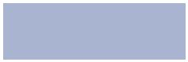
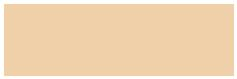

# Portfolio Project: Color Sample Extraction and Visualization

## Project Overview

This project involved the extraction of color samples from a website and their conversion into individual JPG images. The goal was to create a comprehensive collection of color samples for a total of around 2000 colors. These images were organized and saved according to their respective Hex color codes.

## Project Details

- **Data Source**: [Magasin de Peinture Color Chart](https://www.magasindepeinture.ch/en/ncs-color-chart-online.html)
- **Tools and Technologies Used**: Web scraping, Python, BeautifulSoup, CSV, image conversion libraries, Markdown, GitHub

## Project Steps

1. **Web Scraping**: I utilized web scraping techniques to extract color names and their corresponding Hex color codes from the website. The data was saved in a CSV file.

2. **Image Generation**: I used Python libraries to convert the Hex color values into individual JPG images. Each image accurately represents the color associated with the Hex code.

3. **File Organization**: All 2000+ JPG images were organized into a structured folder system, with each folder corresponding to a group of color codes.

4. **Quality Assurance**: I ensured that the generated images were of high quality and accurately reflected the colors they represented. Adjustments were made as needed.

5. **Portfolio Presentation**: This project is showcased in my portfolio to demonstrate my web scraping and data transformation skills.

## Sample Images

Here are a few sample images generated from this project:

## Legal Considerations

I obtained proper permissions to scrape and use the data from the website, adhering to copyright and intellectual property laws.

## Conclusion

This project demonstrates my proficiency in web scraping, data transformation, and image generation. It showcases my ability to work with large datasets and organize them effectively. For additional details or inquiries, please feel free to contact me.

---

For inquiries or to view the complete project, please contact me at [mennoun.abdelfatah@gmail.com](mennoun.abdelfatah@gmail.com).

